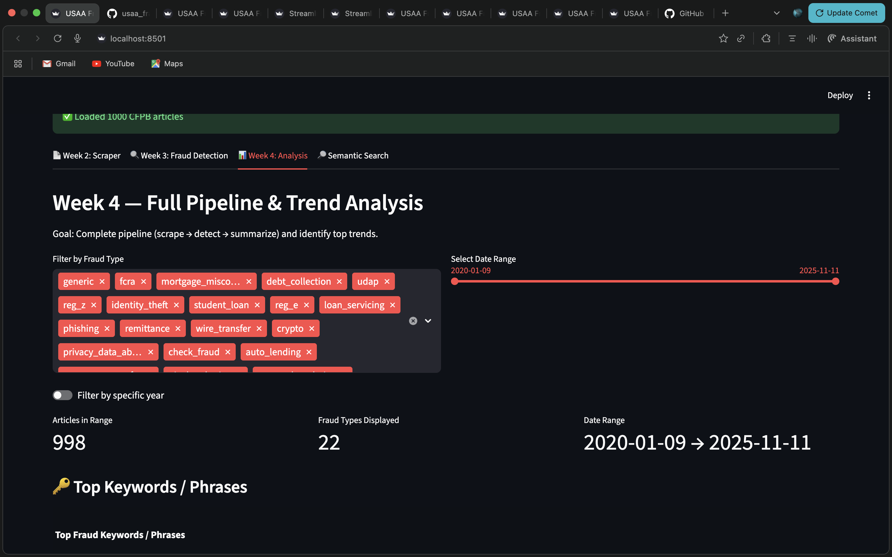
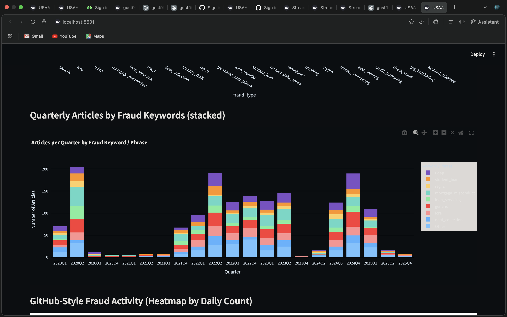
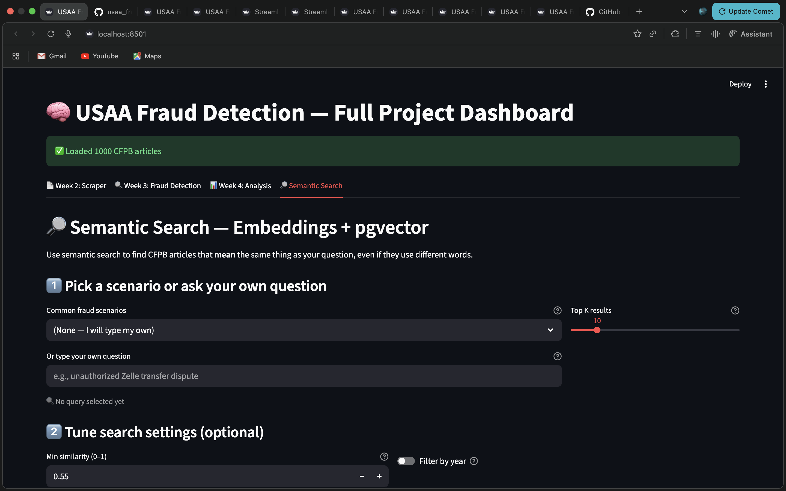
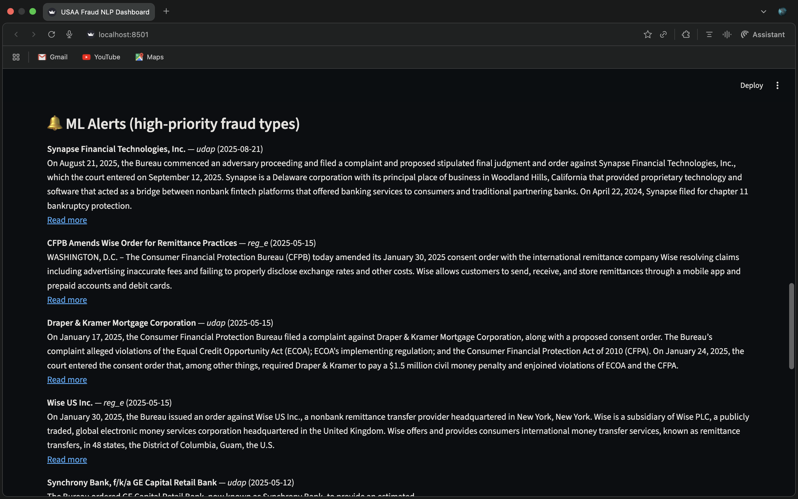
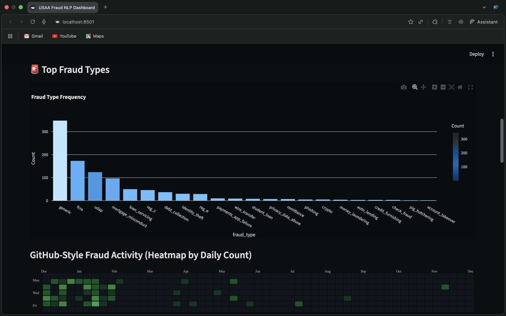

# CFPB Fraud Intelligence Dashboard
Tagline: A dashboard and NLP pipeline for analyzing fraud themes in CFPB articles  
Team Members: Carlin Crawford, Gustave Mensah, Alex Stephenson, Darren Summerlee

## 1. One-Sentence Project Summary
This project builds a full workflow that scrapes CFPB articles, identifies fraud-related patterns using NLP and embeddings, and presents the results in an interactive Streamlit dashboard.

---

## 2. Quick Start
Install dependencies using the command: uv sync  
Create a .env file with the following variables:  
SUPABASE_URL=your-url  
SUPABASE_KEY=your-key  
OPENAI_API_KEY=your-openai-key  
Run the dashboard using the command: uv run streamlit run fraud_dashboard.py

---

## 3. Visuals / Application Design
System Architecture (Mermaid Diagram):

Screenshots 
Dashboard Home 

Semantic Search Page 
 
ML Alerts Panel 

Fraud type

Folder Structure:  
user-fraud-nlp/  
├── cfpb_articles.py  
├── articles_supabase.py  
├── llm_embedding.py  
├── semantic_search.py  
├── ml_train.py  
├── fraud_dashboard.py  
├── models/  
│   ├── logistic_regression_model.pkl  
│   └── fraud_type_svm.joblib  
├── data/  
├── txt/  
├── .env.example  
├── .gitignore  
├── pyproject.toml  
└── uv.lock

## 3.1 What Was Built
The scraper collects articles from CFPB Newsroom, CFPB Blog, and CFPB Enforcement Actions. Each record includes title, date, source, text, and URL.  

Example raw snippet:  
The Bureau filed a complaint alleging unauthorized transfers via Zelle...

Example transformed output:  
{  
"fraud_type": "reg_e",  
"fraud_tags": ["unauthorized_transfer", "zelle_fraud"],  
"summary": "Unauthorized account withdrawals via payment app."  
}

Embeddings are created using the text-embedding-3-small model (1536 dimensions) and stored in Supabase’s pgvector column. Example embedding call:  
embedding = client.embeddings.create(model="text-embedding-3-small", input=text).data[0].embedding  

The ML classifier uses a small SVM model to predict fraud categories based on text or embeddings. Example prediction:  
pred = model.predict([embedding])[0]  

Dashboard tabs include: raw scraped articles, keyword frequencies and word clouds, trend analysis and bar charts, semantic search (preset and custom queries), and ML alerts flagging higher-risk fraud categories.

---

## 4. Findings
This project makes fraud trends across CFPB publications easier to explore and compare. The dashboard reveals repeated themes such as unauthorized transfers, identity theft, mortgage issues, and UDAP. Semantic search helps group cases that use different wording but describe similar events.

Observed patterns include frequent identity theft cases, unauthorized payment transfers, UDAP categories, and loan or servicing issues. Semantic search links ACH errors, account takeovers, Zelle disputes, and similar complaints. The ML classifier highlights articles that resemble known categories even when they are not explicitly labeled.

Examples of insights:  
Searching for “unauthorized Zelle transfer” retrieves ACH disputes, account takeover reports, and related withdrawal issues. High-risk categories such as Regulation E violations and crypto fraud appear immediately in the alerts tab.

Visualizations such as bar charts, word clouds, and search-result displays can be inserted here to demonstrate the findings clearly.

---

.gitignore Important Entries:  
.env  
data/  
__pycache__/  
*.pyc  
.venv/  
uv.lock

---
## 5. Modal Demo Link
https://gust99-glitch--cfpb-fraud-dashboard-run.modal.run/
